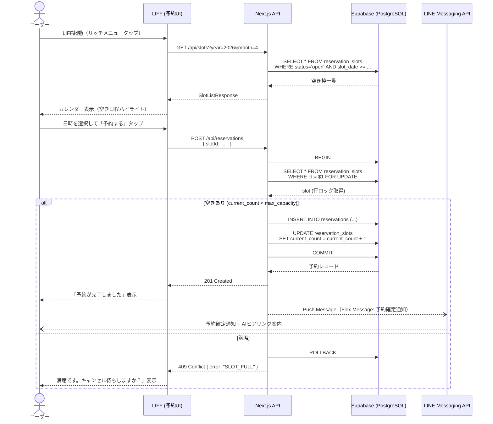
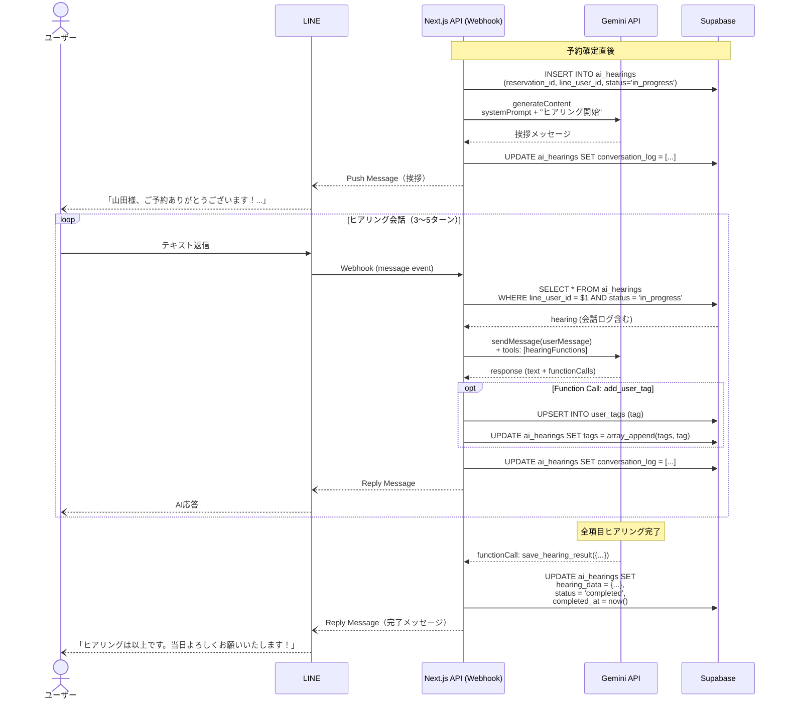
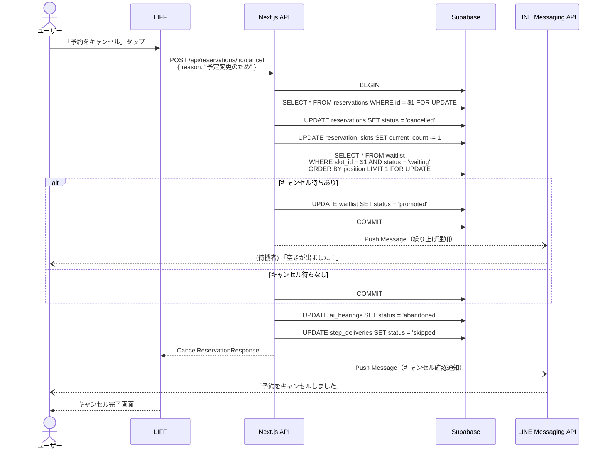
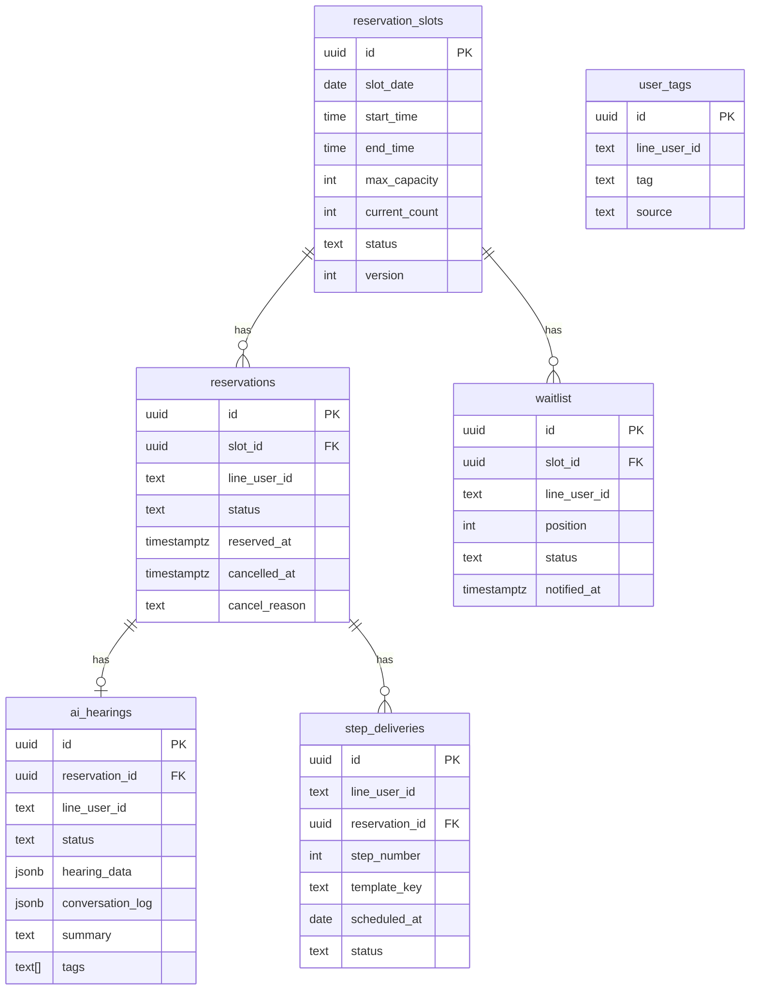

# データ処理フロー仕様書: 予約機能・AIヒアリング

**プロジェクト**: 武居商店「AI搭載型 独自LINEマーケティングシステム」
**ドキュメントID**: SPEC-04
**最終更新**: 2026-03-04
**ステータス**: Draft

---

## 前提条件

| 項目 | 技術選定 |
|------|----------|
| 予約UI | LIFF (LINE Front-end Framework) v2 |
| AIエンジン | Gemini API (Function Calling) |
| データベース | Supabase (PostgreSQL) |
| バックエンド | Next.js API Routes (Vercel) |
| 定期実行 | Vercel Cron Jobs |
| 通知 | LINE Messaging API (Push Message) |

---

## 1. 予約枠管理フロー（管理者側）

### 1.1 概要

管理者が管理画面のカレンダーUIから予約枠を作成・編集・削除する。予約枠には日時・定員・ステータスが含まれる。

### 1.2 データモデル

```sql
-- 予約枠テーブル
CREATE TABLE reservation_slots (
  id UUID PRIMARY KEY DEFAULT gen_random_uuid(),
  slot_date DATE NOT NULL,
  start_time TIME NOT NULL,
  end_time TIME NOT NULL,
  max_capacity INTEGER NOT NULL DEFAULT 1,
  current_count INTEGER NOT NULL DEFAULT 0,
  status TEXT NOT NULL DEFAULT 'open'
    CHECK (status IN ('open', 'closed', 'full')),
  created_at TIMESTAMPTZ NOT NULL DEFAULT now(),
  updated_at TIMESTAMPTZ NOT NULL DEFAULT now(),
  version INTEGER NOT NULL DEFAULT 1,  -- 楽観的ロック用
  UNIQUE (slot_date, start_time)
);

-- updated_at 自動更新トリガー
CREATE OR REPLACE FUNCTION update_updated_at()
RETURNS TRIGGER AS $$
BEGIN
  NEW.updated_at = now();
  NEW.version = OLD.version + 1;
  RETURN NEW;
END;
$$ LANGUAGE plpgsql;

CREATE TRIGGER trg_reservation_slots_updated
  BEFORE UPDATE ON reservation_slots
  FOR EACH ROW EXECUTE FUNCTION update_updated_at();

-- インデックス
CREATE INDEX idx_slots_date_status ON reservation_slots (slot_date, status);
```

### 1.3 TypeScript型定義

```typescript
// types/reservation.ts

export type SlotStatus = 'open' | 'closed' | 'full';

export interface ReservationSlot {
  id: string;
  slotDate: string;       // "2026-04-15"
  startTime: string;      // "10:00"
  endTime: string;        // "11:00"
  maxCapacity: number;
  currentCount: number;
  status: SlotStatus;
  createdAt: string;
  updatedAt: string;
  version: number;
}

export interface CreateSlotRequest {
  slotDate: string;
  startTime: string;
  endTime: string;
  maxCapacity: number;
}

export interface UpdateSlotRequest {
  maxCapacity?: number;
  status?: SlotStatus;
  version: number;  // 楽観的ロック: 現在のversionを送信
}

export interface SlotListResponse {
  slots: ReservationSlot[];
  total: number;
}
```

### 1.4 CRUD APIエンドポイント

#### 予約枠一覧取得

```
GET /api/admin/slots?year=2026&month=4
```

**レスポンス例**:
```json
{
  "slots": [
    {
      "id": "a1b2c3d4-...",
      "slotDate": "2026-04-15",
      "startTime": "10:00",
      "endTime": "11:00",
      "maxCapacity": 3,
      "currentCount": 1,
      "status": "open",
      "version": 1
    }
  ],
  "total": 15
}
```

#### 予約枠作成

```
POST /api/admin/slots
```

**リクエスト例**:
```json
{
  "slotDate": "2026-04-15",
  "startTime": "10:00",
  "endTime": "11:00",
  "maxCapacity": 3
}
```

**レスポンス**: `201 Created` + 作成された `ReservationSlot`

#### 予約枠更新（楽観的ロック付き）

```
PATCH /api/admin/slots/:slotId
```

**リクエスト例**:
```json
{
  "maxCapacity": 5,
  "version": 1
}
```

**バックエンド処理**:
```typescript
// app/api/admin/slots/[slotId]/route.ts

export async function PATCH(
  req: Request,
  { params }: { params: { slotId: string } }
) {
  const body: UpdateSlotRequest = await req.json();

  const { data, error } = await supabase
    .from('reservation_slots')
    .update({
      max_capacity: body.maxCapacity,
      status: body.status,
    })
    .eq('id', params.slotId)
    .eq('version', body.version)  // 楽観的ロック
    .select()
    .single();

  if (!data) {
    return Response.json(
      { error: 'CONFLICT', message: '他の管理者が先に更新しました。再読み込みしてください。' },
      { status: 409 }
    );
  }

  return Response.json(data);
}
```

**競合時レスポンス**: `409 Conflict`
```json
{
  "error": "CONFLICT",
  "message": "他の管理者が先に更新しました。再読み込みしてください。"
}
```

#### 予約枠削除

```
DELETE /api/admin/slots/:slotId
```

**制約**: `current_count > 0` の場合は削除不可（`400 Bad Request`）。既存予約がある枠を削除する場合は、先に予約をキャンセルする必要がある。

### 1.5 カレンダーUI仕様

- 月表示カレンダー上に、各日の予約枠数/空き状況をサマリー表示
- 日付クリックで当日のタイムスロット一覧を展開
- ドラッグ操作で複数日の一括枠作成に対応
- 色分け: 空きあり（緑）/ 残りわずか（黄）/ 満席（赤）/ 休止中（グレー）

---

## 2. 予約申込フロー（ユーザー側）

### 2.1 概要

ユーザーがLIFF上で空き日程を確認し、予約を確定する。同時アクセスによるダブルブッキングを防止するため、`SELECT FOR UPDATE` によるロウロックを使用する。

### 2.2 データモデル

```sql
-- 予約テーブル
CREATE TABLE reservations (
  id UUID PRIMARY KEY DEFAULT gen_random_uuid(),
  slot_id UUID NOT NULL REFERENCES reservation_slots(id),
  line_user_id TEXT NOT NULL,
  user_name TEXT,
  status TEXT NOT NULL DEFAULT 'confirmed'
    CHECK (status IN ('confirmed', 'cancelled', 'completed', 'no_show')),
  reserved_at TIMESTAMPTZ NOT NULL DEFAULT now(),
  cancelled_at TIMESTAMPTZ,
  cancel_reason TEXT,
  created_at TIMESTAMPTZ NOT NULL DEFAULT now(),
  updated_at TIMESTAMPTZ NOT NULL DEFAULT now()
);

CREATE INDEX idx_reservations_slot ON reservations (slot_id, status);
CREATE INDEX idx_reservations_user ON reservations (line_user_id, status);
CREATE UNIQUE INDEX idx_reservations_unique_active
  ON reservations (slot_id, line_user_id)
  WHERE status = 'confirmed';

-- キャンセル待ちテーブル
CREATE TABLE waitlist (
  id UUID PRIMARY KEY DEFAULT gen_random_uuid(),
  slot_id UUID NOT NULL REFERENCES reservation_slots(id),
  line_user_id TEXT NOT NULL,
  position INTEGER NOT NULL,  -- 待ち順
  status TEXT NOT NULL DEFAULT 'waiting'
    CHECK (status IN ('waiting', 'promoted', 'expired', 'cancelled')),
  created_at TIMESTAMPTZ NOT NULL DEFAULT now(),
  notified_at TIMESTAMPTZ
);

CREATE INDEX idx_waitlist_slot_position ON waitlist (slot_id, position)
  WHERE status = 'waiting';
```

### 2.3 TypeScript型定義

```typescript
// types/reservation.ts（追記）

export type ReservationStatus = 'confirmed' | 'cancelled' | 'completed' | 'no_show';

export interface Reservation {
  id: string;
  slotId: string;
  lineUserId: string;
  userName: string | null;
  status: ReservationStatus;
  reservedAt: string;
  cancelledAt: string | null;
  cancelReason: string | null;
}

export interface CreateReservationRequest {
  slotId: string;
}

export interface CreateReservationResponse {
  reservation: Reservation;
  slot: ReservationSlot;
}

export interface WaitlistEntry {
  id: string;
  slotId: string;
  lineUserId: string;
  position: number;
  status: 'waiting' | 'promoted' | 'expired' | 'cancelled';
  createdAt: string;
}
```

### 2.4 予約確保API（race condition対策）

```
POST /api/reservations
```

**リクエスト例**:
```json
{
  "slotId": "a1b2c3d4-..."
}
```

**バックエンド処理（トランザクション + SELECT FOR UPDATE）**:

```typescript
// app/api/reservations/route.ts

import { supabaseAdmin } from '@/lib/supabase-admin';

export async function POST(req: Request) {
  const { slotId } = await req.json();
  const lineUserId = req.headers.get('x-line-user-id')!;

  // Supabase の rpc でトランザクション処理を実行
  const { data, error } = await supabaseAdmin.rpc('create_reservation', {
    p_slot_id: slotId,
    p_line_user_id: lineUserId,
  });

  if (error) {
    if (error.message.includes('SLOT_FULL')) {
      return Response.json(
        { error: 'SLOT_FULL', message: 'この枠は満席です' },
        { status: 409 }
      );
    }
    if (error.message.includes('ALREADY_RESERVED')) {
      return Response.json(
        { error: 'ALREADY_RESERVED', message: '既に予約済みです' },
        { status: 409 }
      );
    }
    return Response.json(
      { error: 'INTERNAL_ERROR' },
      { status: 500 }
    );
  }

  // 予約確定後: LINE通知を非同期で送信
  await sendReservationConfirmation(lineUserId, data);

  return Response.json(data, { status: 201 });
}
```

**PostgreSQL関数（SELECT FOR UPDATE）**:

```sql
CREATE OR REPLACE FUNCTION create_reservation(
  p_slot_id UUID,
  p_line_user_id TEXT
)
RETURNS JSON
LANGUAGE plpgsql
AS $$
DECLARE
  v_slot reservation_slots%ROWTYPE;
  v_reservation reservations%ROWTYPE;
  v_exists BOOLEAN;
BEGIN
  -- 1. 対象スロットを行ロック付きで取得
  SELECT * INTO v_slot
  FROM reservation_slots
  WHERE id = p_slot_id
  FOR UPDATE;

  IF NOT FOUND THEN
    RAISE EXCEPTION 'SLOT_NOT_FOUND';
  END IF;

  -- 2. 空き確認
  IF v_slot.current_count >= v_slot.max_capacity THEN
    RAISE EXCEPTION 'SLOT_FULL';
  END IF;

  IF v_slot.status != 'open' THEN
    RAISE EXCEPTION 'SLOT_CLOSED';
  END IF;

  -- 3. 重複予約チェック
  SELECT EXISTS (
    SELECT 1 FROM reservations
    WHERE slot_id = p_slot_id
      AND line_user_id = p_line_user_id
      AND status = 'confirmed'
  ) INTO v_exists;

  IF v_exists THEN
    RAISE EXCEPTION 'ALREADY_RESERVED';
  END IF;

  -- 4. 予約レコード作成
  INSERT INTO reservations (slot_id, line_user_id)
  VALUES (p_slot_id, p_line_user_id)
  RETURNING * INTO v_reservation;

  -- 5. スロットのカウント更新・満席判定
  UPDATE reservation_slots
  SET
    current_count = current_count + 1,
    status = CASE
      WHEN current_count + 1 >= max_capacity THEN 'full'
      ELSE status
    END
  WHERE id = p_slot_id;

  RETURN json_build_object(
    'reservation', row_to_json(v_reservation),
    'slot', row_to_json(v_slot)
  );
END;
$$;
```

### 2.5 予約確定後のLINE通知

```typescript
// lib/line-notify.ts

import { messagingApi } from '@line/bot-sdk';

const client = new messagingApi.MessagingApiClient({
  channelAccessToken: process.env.LINE_CHANNEL_ACCESS_TOKEN!,
});

export async function sendReservationConfirmation(
  lineUserId: string,
  data: { reservation: Reservation; slot: ReservationSlot }
) {
  const { slot } = data;

  await client.pushMessage({
    to: lineUserId,
    messages: [
      {
        type: 'flex',
        altText: '予約が確定しました',
        contents: {
          type: 'bubble',
          header: {
            type: 'box',
            layout: 'vertical',
            contents: [
              {
                type: 'text',
                text: '予約確定',
                weight: 'bold',
                size: 'lg',
                color: '#1DB446',
              },
            ],
          },
          body: {
            type: 'box',
            layout: 'vertical',
            contents: [
              {
                type: 'text',
                text: `${slot.slotDate} ${slot.startTime}〜${slot.endTime}`,
                size: 'md',
                weight: 'bold',
              },
              {
                type: 'text',
                text: '武居商店 無料相談',
                size: 'sm',
                color: '#666666',
                margin: 'md',
              },
              {
                type: 'separator',
                margin: 'lg',
              },
              {
                type: 'text',
                text: 'この後、AIアシスタントが事前ヒアリングを行います。ご協力をお願いいたします。',
                size: 'xs',
                color: '#888888',
                margin: 'lg',
                wrap: true,
              },
            ],
          },
        },
      },
    ],
  });
}
```

### 2.6 シーケンス図



---

## 3. AIによる事前ヒアリングフロー

### 3.1 概要

予約確定後、LINE Bot がAIチャットを自動開始する。Gemini API の Function Calling を利用して、構造化データを抽出しながらヒアリングを進める。ヒアリング結果は `ai_hearings` テーブルに保存される。

### 3.2 データモデル

```sql
-- AIヒアリング結果テーブル
CREATE TABLE ai_hearings (
  id UUID PRIMARY KEY DEFAULT gen_random_uuid(),
  reservation_id UUID NOT NULL REFERENCES reservations(id),
  line_user_id TEXT NOT NULL,
  status TEXT NOT NULL DEFAULT 'in_progress'
    CHECK (status IN ('in_progress', 'completed', 'abandoned')),
  hearing_data JSONB NOT NULL DEFAULT '{}',
  conversation_log JSONB NOT NULL DEFAULT '[]',
  summary TEXT,
  tags TEXT[] DEFAULT '{}',
  started_at TIMESTAMPTZ NOT NULL DEFAULT now(),
  completed_at TIMESTAMPTZ,
  created_at TIMESTAMPTZ NOT NULL DEFAULT now(),
  updated_at TIMESTAMPTZ NOT NULL DEFAULT now()
);

CREATE INDEX idx_hearings_reservation ON ai_hearings (reservation_id);
CREATE INDEX idx_hearings_user ON ai_hearings (line_user_id, status);

-- ユーザータグテーブル
CREATE TABLE user_tags (
  id UUID PRIMARY KEY DEFAULT gen_random_uuid(),
  line_user_id TEXT NOT NULL,
  tag TEXT NOT NULL,
  source TEXT NOT NULL DEFAULT 'ai_hearing'
    CHECK (source IN ('ai_hearing', 'manual', 'behavior')),
  created_at TIMESTAMPTZ NOT NULL DEFAULT now(),
  UNIQUE (line_user_id, tag)
);

CREATE INDEX idx_user_tags_user ON user_tags (line_user_id);
CREATE INDEX idx_user_tags_tag ON user_tags (tag);
```

### 3.3 TypeScript型定義

```typescript
// types/hearing.ts

export type HearingStatus = 'in_progress' | 'completed' | 'abandoned';

export interface HearingData {
  currentSituation?: string;   // 現在の状況
  concerns?: string[];         // お悩み・課題
  budget?: string;             // 予算感
  timeline?: string;           // 希望時期
  preferredStyle?: string;     // 希望スタイル
  additionalNotes?: string;    // その他メモ
}

export interface ConversationEntry {
  role: 'assistant' | 'user';
  content: string;
  timestamp: string;
  functionCall?: {
    name: string;
    args: Record<string, unknown>;
  };
}

export interface AiHearing {
  id: string;
  reservationId: string;
  lineUserId: string;
  status: HearingStatus;
  hearingData: HearingData;
  conversationLog: ConversationEntry[];
  summary: string | null;
  tags: string[];
  startedAt: string;
  completedAt: string | null;
}

// Gemini Function Calling の戻り値型
export interface SaveHearingResultArgs {
  currentSituation: string;
  concerns: string[];
  budget: string;
  timeline: string;
  preferredStyle: string;
  additionalNotes: string;
  summary: string;
}

export interface AddUserTagArgs {
  tag: string;
  reason: string;
}
```

### 3.4 Gemini API Function Calling 定義

```typescript
// lib/gemini-functions.ts

import { FunctionDeclaration, SchemaType } from '@google/generative-ai';

export const hearingFunctions: FunctionDeclaration[] = [
  {
    name: 'save_hearing_result',
    description:
      'ヒアリングが完了した際に、収集した情報を構造化して保存する。すべての項目が十分に聞き取れた段階で呼び出す。',
    parameters: {
      type: SchemaType.OBJECT,
      properties: {
        currentSituation: {
          type: SchemaType.STRING,
          description: 'お客様の現在の状況（例: 築15年の一戸建て、外壁の色あせが気になる）',
        },
        concerns: {
          type: SchemaType.ARRAY,
          items: { type: SchemaType.STRING },
          description: 'お悩み・課題のリスト',
        },
        budget: {
          type: SchemaType.STRING,
          description: '予算感（例: 50万円以内、100万円前後、未定）',
        },
        timeline: {
          type: SchemaType.STRING,
          description: '希望時期（例: 今月中、3ヶ月以内、急ぎではない）',
        },
        preferredStyle: {
          type: SchemaType.STRING,
          description: '希望するスタイルや仕上がりのイメージ',
        },
        additionalNotes: {
          type: SchemaType.STRING,
          description: 'その他特記事項',
        },
        summary: {
          type: SchemaType.STRING,
          description: 'ヒアリング内容の要約（相談担当者向け、3行以内）',
        },
      },
      required: ['currentSituation', 'concerns', 'summary'],
    },
  },
  {
    name: 'add_user_tag',
    description:
      'ヒアリング中に判明したユーザーの属性をタグとして付与する。会話の途中でも随時呼び出してよい。',
    parameters: {
      type: SchemaType.OBJECT,
      properties: {
        tag: {
          type: SchemaType.STRING,
          description:
            'タグ名（例: 外壁塗装検討中, 築10年以上, 予算100万以内, 急ぎ案件）',
        },
        reason: {
          type: SchemaType.STRING,
          description: 'タグを付与した根拠となる会話内容',
        },
      },
      required: ['tag', 'reason'],
    },
  },
  {
    name: 'escalate_to_human',
    description:
      'AIでは対応が難しい質問や、ユーザーが人間との会話を希望した場合に呼び出す。',
    parameters: {
      type: SchemaType.OBJECT,
      properties: {
        reason: {
          type: SchemaType.STRING,
          description: 'エスカレーション理由',
        },
        urgency: {
          type: SchemaType.STRING,
          enum: ['low', 'medium', 'high'],
          description: '緊急度',
        },
      },
      required: ['reason'],
    },
  },
];
```

### 3.5 プロンプト設計

```typescript
// lib/gemini-prompt.ts

export function buildHearingSystemPrompt(userName: string, slotDate: string): string {
  return `あなたは「武居商店」のAIアシスタントです。
お客様の無料相談（${slotDate}）に向けて、事前ヒアリングを行います。

## あなたの役割
- 親しみやすく丁寧な口調で、お客様のお悩みや要望を聞き出す
- 1回のメッセージで1つの質問に絞る（質問の連投はしない）
- お客様の回答に共感を示してから次の質問に進む

## ヒアリング項目（優先順）
1. 現在の状況（お住まいの種類、築年数など）
2. お悩み・課題（何が気になっているか）
3. 予算感（大まかなイメージ）
4. 希望時期（いつ頃までに実施したいか）
5. 希望するスタイル・仕上がり

## ルール
- 最初の挨拶で「${userName}様、ご予約ありがとうございます」と伝える
- 全項目を聞き終えたら save_hearing_result を呼び出してヒアリングを完了する
- 会話の途中でもユーザーの属性が判明したら add_user_tag を随時呼び出す
- 5ターン以内での完了を目指すが、お客様のペースに合わせる
- 専門用語は避け、わかりやすい言葉で説明する
- AIで回答できない具体的な見積もり等は「当日担当がお伝えします」と案内する
- ユーザーが「人と話したい」等の意思表示をしたら escalate_to_human を呼ぶ`;
}
```

### 3.6 ヒアリング会話の流れ（例）

```
[AI] 山田様、ご予約ありがとうございます！
     当日の相談をより充実させるため、いくつか事前にお伺いしてもよろしいですか？

[User] はい、お願いします

[AI] ありがとうございます！
     まず、お住まいについて教えてください。一戸建てですか？マンションですか？
     また、築何年くらいでしょうか？

     → add_user_tag({ tag: "相談積極的", reason: "事前ヒアリングに快諾" })

[User] 一戸建てで、築12年です

[AI] 築12年の一戸建てなんですね！ちょうどメンテナンスを考え始める時期ですよね。
     今回ご相談いただくにあたって、特に気になっていることはございますか？

     → add_user_tag({ tag: "一戸建て", reason: "一戸建てにお住まい" })
     → add_user_tag({ tag: "築10年以上", reason: "築12年" })

[User] 外壁のひび割れが気になっています。あと色あせも。

[AI] 外壁のひび割れと色あせですね。お住まいの印象にも関わりますし、
     ひび割れは放置すると雨漏りの原因にもなるので、よいタイミングでご相談いただけました。
     ご予算のイメージはございますか？ざっくりで大丈夫ですよ。

     → add_user_tag({ tag: "外壁塗装検討中", reason: "外壁のひび割れ・色あせが気になる" })

[User] できれば80万くらいで収まると嬉しいんですが…

[AI] 80万円くらいが目安ですね、承知しました。
     時期としてはいつ頃までに実施されたいですか？

     → add_user_tag({ tag: "予算100万以内", reason: "80万円希望" })

[User] 梅雨前にはやりたいです

[AI] なるほど、梅雨前ですね！5月頃までがベストですね。
     最後に、色やデザインでご希望があれば教えてください。
     「今と同じ感じ」でも「イメチェンしたい」でも、何でも大丈夫です。

     → add_user_tag({ tag: "急ぎ案件", reason: "梅雨前希望" })

[User] 少し明るめの色にしたいです

[AI] 明るめのお色、素敵ですね！当日は色見本もお持ちできるよう担当に伝えておきます。
     ヒアリングは以上です。当日はよろしくお願いいたします！

     → save_hearing_result({
         currentSituation: "築12年の一戸建て",
         concerns: ["外壁のひび割れ", "外壁の色あせ"],
         budget: "80万円希望",
         timeline: "梅雨前（5月頃まで）",
         preferredStyle: "明るめの色に変更希望",
         additionalNotes: "色見本の持参を希望",
         summary: "築12年一戸建て。外壁のひび割れ・色あせを梅雨前に修繕希望。予算80万円。明るめの色へ変更希望。色見本持参推奨。"
       })
```

### 3.7 Function Calling実行ハンドラ

```typescript
// lib/hearing-handler.ts

import { supabaseAdmin } from '@/lib/supabase-admin';

export async function handleFunctionCall(
  hearingId: string,
  lineUserId: string,
  functionName: string,
  args: Record<string, unknown>
): Promise<string> {
  switch (functionName) {
    case 'save_hearing_result': {
      const result = args as unknown as SaveHearingResultArgs;

      await supabaseAdmin
        .from('ai_hearings')
        .update({
          hearing_data: result,
          summary: result.summary,
          status: 'completed',
          completed_at: new Date().toISOString(),
        })
        .eq('id', hearingId);

      return 'ヒアリング結果を保存しました。';
    }

    case 'add_user_tag': {
      const { tag, reason } = args as AddUserTagArgs;

      await supabaseAdmin
        .from('user_tags')
        .upsert(
          { line_user_id: lineUserId, tag, source: 'ai_hearing' },
          { onConflict: 'line_user_id,tag' }
        );

      // ヒアリングレコードの tags 配列にも追記
      await supabaseAdmin.rpc('append_hearing_tag', {
        p_hearing_id: hearingId,
        p_tag: tag,
      });

      return `タグ "${tag}" を付与しました。`;
    }

    case 'escalate_to_human': {
      const { reason, urgency } = args as { reason: string; urgency?: string };

      // 管理者へ通知（実装省略: 管理用LINEグループへPush）
      await notifyAdmin({
        type: 'escalation',
        lineUserId,
        hearingId,
        reason,
        urgency: urgency ?? 'medium',
      });

      return 'スタッフへの引き継ぎを手配しました。';
    }

    default:
      return `不明な関数: ${functionName}`;
  }
}
```

```sql
-- タグ追記用ヘルパー関数
CREATE OR REPLACE FUNCTION append_hearing_tag(
  p_hearing_id UUID,
  p_tag TEXT
)
RETURNS VOID
LANGUAGE plpgsql
AS $$
BEGIN
  UPDATE ai_hearings
  SET tags = array_append(tags, p_tag)
  WHERE id = p_hearing_id
    AND NOT (p_tag = ANY(tags));
END;
$$;
```

### 3.8 Webhook処理（LINE → Gemini → LINE）

```typescript
// app/api/webhook/route.ts（ヒアリング部分の抜粋）

import { GoogleGenerativeAI } from '@google/generative-ai';
import { hearingFunctions } from '@/lib/gemini-functions';
import { buildHearingSystemPrompt } from '@/lib/gemini-prompt';
import { handleFunctionCall } from '@/lib/hearing-handler';

const genAI = new GoogleGenerativeAI(process.env.GEMINI_API_KEY!);

async function handleHearingMessage(
  lineUserId: string,
  userMessage: string
) {
  // 1. 進行中のヒアリングセッションを取得
  const { data: hearing } = await supabaseAdmin
    .from('ai_hearings')
    .select('*, reservations!inner(*, reservation_slots!inner(*))')
    .eq('line_user_id', lineUserId)
    .eq('status', 'in_progress')
    .single();

  if (!hearing) return null;  // ヒアリング中でなければスキップ

  // 2. 会話ログにユーザーメッセージを追加
  const conversationLog: ConversationEntry[] = [
    ...hearing.conversation_log,
    { role: 'user', content: userMessage, timestamp: new Date().toISOString() },
  ];

  // 3. Gemini API 呼び出し
  const model = genAI.getGenerativeModel({
    model: 'gemini-2.0-flash',
    tools: [{ functionDeclarations: hearingFunctions }],
    systemInstruction: buildHearingSystemPrompt(
      hearing.reservations.user_name ?? 'お客様',
      hearing.reservations.reservation_slots.slot_date
    ),
  });

  const chat = model.startChat({
    history: conversationLog.map((entry) => ({
      role: entry.role === 'assistant' ? 'model' : 'user',
      parts: [{ text: entry.content }],
    })),
  });

  const result = await chat.sendMessage(userMessage);
  const response = result.response;

  let replyText = '';
  const functionCalls = response.functionCalls();

  // 4. Function Calling の処理
  if (functionCalls && functionCalls.length > 0) {
    for (const fc of functionCalls) {
      await handleFunctionCall(
        hearing.id,
        lineUserId,
        fc.name,
        fc.args as Record<string, unknown>
      );
    }
  }

  // 5. テキスト応答の取得
  replyText = response.text() || '';

  // 6. 会話ログの更新
  conversationLog.push({
    role: 'assistant',
    content: replyText,
    timestamp: new Date().toISOString(),
    functionCall: functionCalls?.[0]
      ? { name: functionCalls[0].name, args: functionCalls[0].args as Record<string, unknown> }
      : undefined,
  });

  await supabaseAdmin
    .from('ai_hearings')
    .update({ conversation_log: conversationLog })
    .eq('id', hearing.id);

  return replyText;
}
```

### 3.9 シーケンス図



---

## 4. 予約リマインド・事後フォロー自動化

### 4.1 概要

Vercel Cron Jobs を使って、予約前日のリマインドと相談実施後のフォローメッセージを自動配信する。

### 4.2 Cron定義

```json
// vercel.json
{
  "crons": [
    {
      "path": "/api/cron/remind",
      "schedule": "0 9 * * *"
    },
    {
      "path": "/api/cron/follow-up",
      "schedule": "0 18 * * *"
    },
    {
      "path": "/api/cron/step-delivery",
      "schedule": "0 10 * * *"
    }
  ]
}
```

### 4.3 前日リマインド配信

```typescript
// app/api/cron/remind/route.ts

import { supabaseAdmin } from '@/lib/supabase-admin';
import { sendPushMessage } from '@/lib/line-notify';

export async function GET(req: Request) {
  // Vercel Cron 認証チェック
  const authHeader = req.headers.get('authorization');
  if (authHeader !== `Bearer ${process.env.CRON_SECRET}`) {
    return Response.json({ error: 'Unauthorized' }, { status: 401 });
  }

  const tomorrow = new Date();
  tomorrow.setDate(tomorrow.getDate() + 1);
  const tomorrowStr = tomorrow.toISOString().split('T')[0];

  // 明日の予約を取得
  const { data: reservations } = await supabaseAdmin
    .from('reservations')
    .select('*, reservation_slots!inner(*)')
    .eq('status', 'confirmed')
    .eq('reservation_slots.slot_date', tomorrowStr);

  if (!reservations || reservations.length === 0) {
    return Response.json({ message: 'No reminders to send', count: 0 });
  }

  let sentCount = 0;

  for (const reservation of reservations) {
    const slot = reservation.reservation_slots;

    await sendPushMessage(reservation.line_user_id, [
      {
        type: 'flex',
        altText: '明日のご予約リマインド',
        contents: {
          type: 'bubble',
          body: {
            type: 'box',
            layout: 'vertical',
            contents: [
              {
                type: 'text',
                text: '明日のご予約リマインド',
                weight: 'bold',
                size: 'md',
                color: '#E85D3A',
              },
              {
                type: 'text',
                text: `${slot.slot_date} ${slot.start_time}〜${slot.end_time}`,
                size: 'lg',
                weight: 'bold',
                margin: 'md',
              },
              {
                type: 'text',
                text: 'ご不明点がございましたらお気軽にメッセージください。',
                size: 'xs',
                color: '#888888',
                margin: 'lg',
                wrap: true,
              },
            ],
          },
        },
      },
    ]);
    sentCount++;
  }

  return Response.json({ message: 'Reminders sent', count: sentCount });
}
```

### 4.4 相談実施後のフォローメッセージ

```typescript
// app/api/cron/follow-up/route.ts

export async function GET(req: Request) {
  const authHeader = req.headers.get('authorization');
  if (authHeader !== `Bearer ${process.env.CRON_SECRET}`) {
    return Response.json({ error: 'Unauthorized' }, { status: 401 });
  }

  const today = new Date().toISOString().split('T')[0];

  // 本日実施済みの予約を取得
  const { data: reservations } = await supabaseAdmin
    .from('reservations')
    .select('*, reservation_slots!inner(*), ai_hearings(*)')
    .eq('status', 'completed')
    .eq('reservation_slots.slot_date', today);

  if (!reservations || reservations.length === 0) {
    return Response.json({ message: 'No follow-ups to send', count: 0 });
  }

  let sentCount = 0;

  for (const reservation of reservations) {
    await sendPushMessage(reservation.line_user_id, [
      {
        type: 'text',
        text: `本日はご相談ありがとうございました！\n\nご不明点や追加のご質問がございましたら、いつでもこちらからメッセージをお送りください。\n\nまた、お見積りの詳細は改めてご連絡いたします。`,
      },
    ]);
    sentCount++;
  }

  // ステップ配信スケジュールを登録
  for (const reservation of reservations) {
    await supabaseAdmin.from('step_deliveries').insert([
      {
        line_user_id: reservation.line_user_id,
        reservation_id: reservation.id,
        step_number: 1,
        scheduled_at: addDays(today, 3),  // 3日後
        template_key: 'after_consultation_step1',
        status: 'pending',
      },
      {
        line_user_id: reservation.line_user_id,
        reservation_id: reservation.id,
        step_number: 2,
        scheduled_at: addDays(today, 7),  // 7日後
        template_key: 'after_consultation_step2',
        status: 'pending',
      },
      {
        line_user_id: reservation.line_user_id,
        reservation_id: reservation.id,
        step_number: 3,
        scheduled_at: addDays(today, 14), // 14日後
        template_key: 'after_consultation_step3',
        status: 'pending',
      },
    ]);
  }

  return Response.json({ message: 'Follow-ups sent', count: sentCount });
}

function addDays(dateStr: string, days: number): string {
  const date = new Date(dateStr);
  date.setDate(date.getDate() + days);
  return date.toISOString().split('T')[0];
}
```

### 4.5 ステップ配信データモデルとCron

```sql
-- ステップ配信テーブル
CREATE TABLE step_deliveries (
  id UUID PRIMARY KEY DEFAULT gen_random_uuid(),
  line_user_id TEXT NOT NULL,
  reservation_id UUID REFERENCES reservations(id),
  step_number INTEGER NOT NULL,
  template_key TEXT NOT NULL,
  scheduled_at DATE NOT NULL,
  status TEXT NOT NULL DEFAULT 'pending'
    CHECK (status IN ('pending', 'sent', 'skipped', 'failed')),
  sent_at TIMESTAMPTZ,
  created_at TIMESTAMPTZ NOT NULL DEFAULT now()
);

CREATE INDEX idx_step_deliveries_schedule
  ON step_deliveries (scheduled_at, status)
  WHERE status = 'pending';
```

```typescript
// app/api/cron/step-delivery/route.ts

export async function GET(req: Request) {
  const authHeader = req.headers.get('authorization');
  if (authHeader !== `Bearer ${process.env.CRON_SECRET}`) {
    return Response.json({ error: 'Unauthorized' }, { status: 401 });
  }

  const today = new Date().toISOString().split('T')[0];

  const { data: deliveries } = await supabaseAdmin
    .from('step_deliveries')
    .select('*')
    .eq('status', 'pending')
    .lte('scheduled_at', today);

  if (!deliveries || deliveries.length === 0) {
    return Response.json({ message: 'No deliveries', count: 0 });
  }

  let sentCount = 0;

  for (const delivery of deliveries) {
    try {
      const template = getStepTemplate(delivery.template_key);
      await sendPushMessage(delivery.line_user_id, template);

      await supabaseAdmin
        .from('step_deliveries')
        .update({ status: 'sent', sent_at: new Date().toISOString() })
        .eq('id', delivery.id);

      sentCount++;
    } catch (error) {
      await supabaseAdmin
        .from('step_deliveries')
        .update({ status: 'failed' })
        .eq('id', delivery.id);
    }
  }

  return Response.json({ message: 'Step deliveries processed', count: sentCount });
}
```

### 4.6 ステップ配信スケジュール

| ステップ | タイミング | テンプレートキー | 内容 |
|---------|-----------|-----------------|------|
| 1 | 相談後3日 | `after_consultation_step1` | 「先日はありがとうございました。ご検討の進捗はいかがですか？」 |
| 2 | 相談後7日 | `after_consultation_step2` | 施工事例の紹介 + 「ご質問があればお気軽にどうぞ」 |
| 3 | 相談後14日 | `after_consultation_step3` | 期間限定特典の案内 + 「再相談も無料です」 |

---

## 5. キャンセル・変更処理

### 5.1 キャンセルポリシー

| 条件 | 対応 |
|------|------|
| 予約日の2日前まで | 無条件キャンセル可 |
| 予約日の前日 | キャンセル可（確認メッセージ表示） |
| 予約日当日 | キャンセル可（「当日キャンセル」タグ付与） |

### 5.2 キャンセルAPI

```
POST /api/reservations/:reservationId/cancel
```

**リクエスト例**:
```json
{
  "reason": "予定が入ってしまったため"
}
```

**TypeScript型定義**:
```typescript
// types/reservation.ts（追記）

export interface CancelReservationRequest {
  reason?: string;
}

export interface CancelReservationResponse {
  reservation: Reservation;
  waitlistPromoted: boolean;  // キャンセル待ち繰り上げが発生したか
}
```

**バックエンド処理**:

```typescript
// app/api/reservations/[reservationId]/cancel/route.ts

export async function POST(
  req: Request,
  { params }: { params: { reservationId: string } }
) {
  const lineUserId = req.headers.get('x-line-user-id')!;
  const body: CancelReservationRequest = await req.json();

  const { data, error } = await supabaseAdmin.rpc('cancel_reservation', {
    p_reservation_id: params.reservationId,
    p_line_user_id: lineUserId,
    p_reason: body.reason ?? null,
  });

  if (error) {
    if (error.message.includes('NOT_FOUND')) {
      return Response.json({ error: 'NOT_FOUND' }, { status: 404 });
    }
    if (error.message.includes('ALREADY_CANCELLED')) {
      return Response.json({ error: 'ALREADY_CANCELLED' }, { status: 409 });
    }
    return Response.json({ error: 'INTERNAL_ERROR' }, { status: 500 });
  }

  // キャンセル確認の通知
  await sendPushMessage(lineUserId, [
    {
      type: 'text',
      text: '予約をキャンセルしました。\nまたのご予約をお待ちしております。',
    },
  ]);

  // 当日キャンセルの場合タグ付与
  const reservation = data.reservation;
  const slot = data.slot;
  const today = new Date().toISOString().split('T')[0];
  if (slot.slot_date === today) {
    await supabaseAdmin.from('user_tags').upsert(
      { line_user_id: lineUserId, tag: '当日キャンセル', source: 'behavior' },
      { onConflict: 'line_user_id,tag' }
    );
  }

  return Response.json(data);
}
```

### 5.3 キャンセル処理（PostgreSQL関数）

```sql
CREATE OR REPLACE FUNCTION cancel_reservation(
  p_reservation_id UUID,
  p_line_user_id TEXT,
  p_reason TEXT DEFAULT NULL
)
RETURNS JSON
LANGUAGE plpgsql
AS $$
DECLARE
  v_reservation reservations%ROWTYPE;
  v_slot reservation_slots%ROWTYPE;
  v_waitlist waitlist%ROWTYPE;
  v_promoted BOOLEAN := FALSE;
BEGIN
  -- 1. 予約を取得・検証
  SELECT * INTO v_reservation
  FROM reservations
  WHERE id = p_reservation_id
    AND line_user_id = p_line_user_id
  FOR UPDATE;

  IF NOT FOUND THEN
    RAISE EXCEPTION 'NOT_FOUND';
  END IF;

  IF v_reservation.status != 'confirmed' THEN
    RAISE EXCEPTION 'ALREADY_CANCELLED';
  END IF;

  -- 2. 予約をキャンセル
  UPDATE reservations
  SET
    status = 'cancelled',
    cancelled_at = now(),
    cancel_reason = p_reason
  WHERE id = p_reservation_id;

  -- 3. スロットのカウントを減らし、ステータスを戻す
  UPDATE reservation_slots
  SET
    current_count = GREATEST(current_count - 1, 0),
    status = CASE
      WHEN status = 'full' THEN 'open'
      ELSE status
    END
  WHERE id = v_reservation.slot_id
  RETURNING * INTO v_slot;

  -- 4. キャンセル待ち繰り上げ
  SELECT * INTO v_waitlist
  FROM waitlist
  WHERE slot_id = v_reservation.slot_id
    AND status = 'waiting'
  ORDER BY position ASC
  LIMIT 1
  FOR UPDATE;

  IF FOUND THEN
    -- 繰り上げ対象を promoted に変更
    UPDATE waitlist
    SET status = 'promoted', notified_at = now()
    WHERE id = v_waitlist.id;

    v_promoted := TRUE;
  END IF;

  -- 5. 進行中のヒアリングがあれば中断
  UPDATE ai_hearings
  SET status = 'abandoned'
  WHERE reservation_id = p_reservation_id
    AND status = 'in_progress';

  -- 6. ステップ配信をスキップ
  UPDATE step_deliveries
  SET status = 'skipped'
  WHERE reservation_id = p_reservation_id
    AND status = 'pending';

  SELECT * INTO v_reservation
  FROM reservations WHERE id = p_reservation_id;

  RETURN json_build_object(
    'reservation', row_to_json(v_reservation),
    'slot', row_to_json(v_slot),
    'waitlistPromoted', v_promoted,
    'promotedUserId', CASE WHEN v_promoted THEN v_waitlist.line_user_id ELSE NULL END
  );
END;
$$;
```

### 5.4 キャンセル待ち繰り上げ通知

```typescript
// lib/waitlist-notify.ts

export async function notifyWaitlistPromotion(
  lineUserId: string,
  slot: ReservationSlot
) {
  await sendPushMessage(lineUserId, [
    {
      type: 'flex',
      altText: 'キャンセル待ちの枠が空きました',
      contents: {
        type: 'bubble',
        body: {
          type: 'box',
          layout: 'vertical',
          contents: [
            {
              type: 'text',
              text: '空きが出ました！',
              weight: 'bold',
              size: 'lg',
              color: '#1DB446',
            },
            {
              type: 'text',
              text: `${slot.slotDate} ${slot.startTime}〜${slot.endTime}`,
              size: 'md',
              weight: 'bold',
              margin: 'md',
            },
            {
              type: 'text',
              text: '24時間以内にご予約を確定してください。期限を過ぎると次の方へご案内いたします。',
              size: 'xs',
              color: '#888888',
              margin: 'lg',
              wrap: true,
            },
          ],
        },
        footer: {
          type: 'box',
          layout: 'vertical',
          contents: [
            {
              type: 'button',
              action: {
                type: 'uri',
                label: '予約を確定する',
                uri: `${process.env.LIFF_URL}/reserve?slotId=${slot.id}&promotion=true`,
              },
              style: 'primary',
              color: '#1DB446',
            },
          ],
        },
      },
    },
  ]);
}
```

### 5.5 キャンセル待ち期限切れ処理

```typescript
// app/api/cron/waitlist-expire/route.ts
// vercel.json に追加: { "path": "/api/cron/waitlist-expire", "schedule": "0 * * * *" }

export async function GET(req: Request) {
  const authHeader = req.headers.get('authorization');
  if (authHeader !== `Bearer ${process.env.CRON_SECRET}`) {
    return Response.json({ error: 'Unauthorized' }, { status: 401 });
  }

  const expireThreshold = new Date();
  expireThreshold.setHours(expireThreshold.getHours() - 24);

  // 通知から24時間経過した promoted エントリを期限切れに
  const { data: expired } = await supabaseAdmin
    .from('waitlist')
    .update({ status: 'expired' })
    .eq('status', 'promoted')
    .lt('notified_at', expireThreshold.toISOString())
    .select();

  // 期限切れの枠について次の待機者を繰り上げ
  if (expired && expired.length > 0) {
    for (const entry of expired) {
      const { data: next } = await supabaseAdmin
        .from('waitlist')
        .select('*')
        .eq('slot_id', entry.slot_id)
        .eq('status', 'waiting')
        .order('position', { ascending: true })
        .limit(1)
        .single();

      if (next) {
        await supabaseAdmin
          .from('waitlist')
          .update({ status: 'promoted', notified_at: new Date().toISOString() })
          .eq('id', next.id);

        const { data: slot } = await supabaseAdmin
          .from('reservation_slots')
          .select('*')
          .eq('id', next.slot_id)
          .single();

        if (slot) {
          await notifyWaitlistPromotion(next.line_user_id, slot);
        }
      }
    }
  }

  return Response.json({
    message: 'Waitlist expiry processed',
    expiredCount: expired?.length ?? 0,
  });
}
```

### 5.6 予約変更フロー

予約の「変更」は、既存予約のキャンセル + 新規予約の2ステップで実装する。

```typescript
// app/api/reservations/[reservationId]/change/route.ts

export interface ChangeReservationRequest {
  newSlotId: string;
  reason?: string;
}

export async function POST(
  req: Request,
  { params }: { params: { reservationId: string } }
) {
  const lineUserId = req.headers.get('x-line-user-id')!;
  const body: ChangeReservationRequest = await req.json();

  // トランザクションで旧予約キャンセル + 新予約作成を一括実行
  const { data, error } = await supabaseAdmin.rpc('change_reservation', {
    p_old_reservation_id: params.reservationId,
    p_new_slot_id: body.newSlotId,
    p_line_user_id: lineUserId,
    p_reason: body.reason ?? '予約変更',
  });

  if (error) {
    if (error.message.includes('NEW_SLOT_FULL')) {
      return Response.json(
        { error: 'NEW_SLOT_FULL', message: '変更先の枠は満席です' },
        { status: 409 }
      );
    }
    return Response.json({ error: error.message }, { status: 400 });
  }

  // 変更完了通知
  await sendPushMessage(lineUserId, [
    {
      type: 'text',
      text: `予約を変更しました。\n\n新しい日時: ${data.newSlot.slot_date} ${data.newSlot.start_time}〜${data.newSlot.end_time}\n\n当日お待ちしております！`,
    },
  ]);

  return Response.json(data);
}
```

### 5.7 キャンセル・変更シーケンス図



---

## 付録: テーブル一覧

| テーブル名 | 用途 |
|-----------|------|
| `reservation_slots` | 予約枠（日時・定員・ステータス） |
| `reservations` | 予約レコード |
| `waitlist` | キャンセル待ち |
| `ai_hearings` | AIヒアリング結果・会話ログ |
| `user_tags` | ユーザータグ（AI付与/手動/行動ベース） |
| `step_deliveries` | ステップ配信スケジュール |

## 付録: ER図


